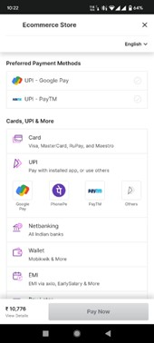

# MyShop Ecommerce Application
## Introduction
 MyShop is an e-commerce android application built using Kotlin, firebase is used in backend. Razorpay payment gateway is integrated. This project also contains an application for the shop owner, the MyShop Admin application using which the show owner can manage the content of the main application. It has features like managing orders, products, categories and changing ad banners of the main application.

## Kotlin Libraries Used
 * [Glide][1]
 * [ImageSlideShow][2].

[1]:https://bumptech.github.io/glide/
[2]: https://github.com/denzcoskun/ImageSlideshow

Add your Razorpay API key to the AndroidManifest.xml file to use razorpay.

## Screenshots
* ### MyShop App
               

* ### Admin App 

